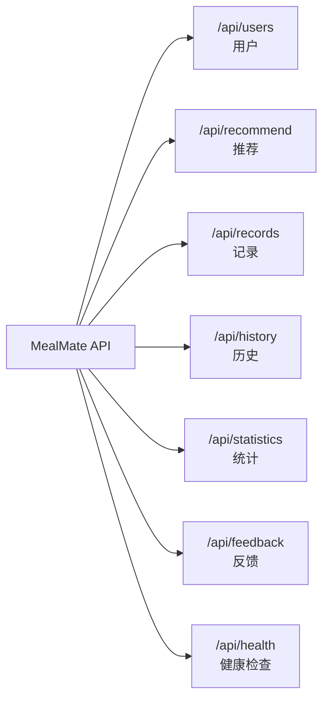

# MealMate（餐伴）- API 接口文档

## 基础信息

- **Base URL**: `http://localhost:8000`
- **数据格式**: JSON
- **字符编码**: UTF-8
- **Swagger 文档**: http://localhost:8000/docs

## 接口总览



| 模块 | 方法 | 路径 | 说明 |
|------|------|------|------|
| 用户 | POST | /api/users/register | 用户注册 |
| 用户 | GET | /api/users/me | 获取当前用户 |
| 用户 | PUT | /api/users/me | 更新用户信息 |
| 推荐 | POST | /api/recommend | 随机推荐 |
| 推荐 | POST | /api/recommend/quick/{scenario} | 场景快捷推荐 |
| 记录 | POST | /api/records | 创建记录 |
| 记录 | GET | /api/records | 获取记录列表 |
| 记录 | GET | /api/records/{id} | 获取单条记录 |
| 记录 | PUT | /api/records/{id} | 更新记录 |
| 记录 | DELETE | /api/records/{id} | 删除记录 |
| 历史 | GET | /api/history/calendar | 日历视图 |
| 历史 | GET | /api/history/timeline | 时间轴 |
| 历史 | GET | /api/history/search | 搜索记录 |
| 统计 | GET | /api/statistics | 获取统计数据 |
| 反馈 | POST | /api/feedback | 提交反馈 |
| 健康 | GET | /api/health | 健康检查 |

---

## 用户模块

### POST /api/users/register

用户注册

**请求体：**

```json
{
  "phone": "13800001111",
  "nickname": "吃货小王",
  "avatar": "https://example.com/avatar.jpg",
  "taste_tags": ["辣", "下饭"]
}
```

| 字段 | 类型 | 必填 | 说明 |
|------|------|------|------|
| phone | string | 是 | 手机号，唯一 |
| nickname | string | 是 | 昵称 |
| avatar | string | 否 | 头像 URL |
| taste_tags | string[] | 否 | 口味标签 |

**成功响应 (201)：**

```json
{
  "id": 1,
  "phone": "13800001111",
  "nickname": "吃货小王",
  "avatar": "https://example.com/avatar.jpg",
  "taste_tags": ["辣", "下饭"],
  "created_at": "2024-01-01T00:00:00"
}
```

**错误响应：**

| 状态码 | 说明 |
|--------|------|
| 400 | 手机号已注册 |
| 422 | 必填字段缺失 |

---

### GET /api/users/me

获取当前用户信息

**响应 (200)：**

```json
{
  "id": 1,
  "phone": "13800001111",
  "nickname": "吃货小王",
  "avatar": "https://example.com/avatar.jpg",
  "taste_tags": ["辣", "下饭"],
  "created_at": "2024-01-01T00:00:00"
}
```

---

### PUT /api/users/me

更新用户信息

**请求体：**

```json
{
  "nickname": "美食家小王",
  "taste_tags": ["辣", "鲜", "下饭"]
}
```

所有字段均为可选。

---

## 推荐模块

### POST /api/recommend

随机推荐一道菜（核心功能）

**请求体（可选）：**

```json
{
  "taste": "辣",
  "cuisine": "川菜",
  "meal_type": "午餐",
  "price_range": "¥20-50",
  "calorie_range": "中卡(400-700)"
}
```

| 字段 | 类型 | 可选值 |
|------|------|--------|
| taste | string | 辣/不辣/酸/甜/鲜 |
| cuisine | string | 川菜/粤菜/湘菜/日料/西餐/东南亚 |
| meal_type | string | 早餐/午餐/晚餐/下午茶/夜宵 |
| price_range | string | ¥20以下/¥20-50/¥50-100/无限制 |
| calorie_range | string | 低卡(<400)/中卡(400-700)/高卡(>700) |

**成功响应 (200)：**

```json
{
  "dish": {
    "id": 1,
    "name": "宫保鸡丁",
    "cuisine": "川菜",
    "tags": ["辣", "下饭"],
    "reference_price": 28,
    "prep_time": 20,
    "calories": 450,
    "image_url": null,
    "is_active": true,
    "created_at": "2024-01-01T00:00:00"
  },
  "reason": "今天天气适合来点这个！"
}
```

**错误响应：**

| 状态码 | 说明 |
|--------|------|
| 404 | 没有找到符合条件的菜品 |

---

### POST /api/recommend/quick/{scenario}

场景快捷推荐

**路径参数：**

| 参数 | 可选值 | 说明 |
|------|--------|------|
| scenario | hungry | 我超饿（筛选 prep_time <= 25分钟） |
| scenario | casual | 随便就行（纯随机） |
| scenario | fridge | 清理冰箱（筛选 prep_time <= 20分钟） |

---

## 饮食记录模块

### POST /api/records

创建饮食记录

**请求体：**

```json
{
  "dish_name": "宫保鸡丁",
  "meal_type": "午餐",
  "location_name": "川味小馆",
  "cost": 28,
  "calories": 450,
  "rating": 4,
  "meal_date": "2024-01-15",
  "note": "微辣，好吃",
  "tags": ["川菜", "下饭"]
}
```

| 字段 | 类型 | 必填 | 说明 |
|------|------|------|------|
| dish_name | string | 是 | 菜品名称 |
| meal_type | enum | 是 | 早餐/午餐/晚餐/下午茶/夜宵 |
| rating | int | 是 | 1-5 星 |
| meal_date | date | 是 | 用餐日期 |
| location_name | string | 否 | 地点名称 |
| cost | float | 否 | 花费金额 |
| calories | int | 否 | 热量千卡 |
| note | string | 否 | 备注 |
| tags | string[] | 否 | 标签 |
| latitude | float | 否 | GPS 纬度 |
| longitude | float | 否 | GPS 经度 |
| photo_url | string | 否 | 照片 URL |

**成功响应 (201)：**

```json
{
  "id": 1,
  "user_id": 1,
  "dish_name": "宫保鸡丁",
  "meal_type": "午餐",
  "location_name": "川味小馆",
  "cost": 28,
  "calories": 450,
  "rating": 4,
  "meal_date": "2024-01-15",
  "note": "微辣，好吃",
  "tags": ["川菜", "下饭"],
  "created_at": "2024-01-01T00:00:00"
}
```

---

### GET /api/records

获取记录列表

**查询参数：**

| 参数 | 类型 | 默认值 | 说明 |
|------|------|--------|------|
| page | int | 1 | 页码 |
| page_size | int | 20 | 每页条数（最大100） |
| start_date | string | - | 起始日期 YYYY-MM-DD |
| end_date | string | - | 结束日期 YYYY-MM-DD |
| meal_type | string | - | 用餐类型筛选 |

**响应 (200)：**

```json
{
  "items": [...],
  "total": 42,
  "page": 1,
  "page_size": 20
}
```

---

### GET /api/records/{record_id}

获取单条记录

**响应 (200)**：返回完整记录对象

**错误 (404)**：记录不存在

---

### PUT /api/records/{record_id}

更新记录（所有字段可选）

---

### DELETE /api/records/{record_id}

删除记录

**响应 (204)**：无内容

---

## 历史回顾模块

### GET /api/history/calendar

日历视图

**查询参数：**

| 参数 | 类型 | 必填 | 说明 |
|------|------|------|------|
| year | int | 是 | 年份 |
| month | int | 是 | 月份 |

**响应 (200)：**

```json
[
  {
    "date": "2024-01-15",
    "count": 3,
    "dishes": ["皮蛋瘦肉粥", "宫保鸡丁", "白切鸡"]
  }
]
```

---

### GET /api/history/timeline

时间轴浏览

**查询参数：** page, page_size（同记录列表）

---

### GET /api/history/search

搜索记录

**查询参数：**

| 参数 | 类型 | 说明 |
|------|------|------|
| keyword | string | 菜品名称模糊搜索 |
| location | string | 地点模糊搜索 |
| start_date | string | 起始日期 |
| end_date | string | 结束日期 |
| page | int | 页码 |
| page_size | int | 每页条数 |

---

## 统计分析模块

### GET /api/statistics

获取统计数据

**查询参数：**

| 参数 | 类型 | 默认值 | 说明 |
|------|------|--------|------|
| period | string | week | week/month/custom |
| start_date | string | - | 自定义起始日期 |
| end_date | string | - | 自定义结束日期 |

**响应 (200)：**

```json
{
  "weekly_cost": [
    {"date": "2024-01-15", "cost": 85.5}
  ],
  "category_distribution": [
    {"cuisine": "午餐", "count": 5, "percentage": 50.0}
  ],
  "calorie_trend": [
    {"date": "2024-01-15", "calories": 1850}
  ],
  "top_locations": [
    {"location_name": "川味小馆", "visit_count": 5}
  ],
  "favorite_dishes": [
    {"dish_name": "宫保鸡丁", "avg_rating": 4.5, "count": 3}
  ]
}
```

---

## 用户反馈模块

### POST /api/feedback

提交菜品反馈

**请求体：**

```json
{
  "dish_id": 1,
  "action": "like"
}
```

| 字段 | 类型 | 可选值 |
|------|------|--------|
| dish_id | int | 菜品 ID |
| action | string | like/dislike/accept |

**成功响应 (201)**

**错误：**

| 状态码 | 说明 |
|--------|------|
| 404 | 菜品不存在 |
| 422 | 无效的 action 值 |

---

## 健康检查

### GET /api/health

**响应 (200)：**

```json
{"status": "ok"}
```

---

## 错误码汇总

| 状态码 | 说明 |
|--------|------|
| 200 | 成功 |
| 201 | 创建成功 |
| 204 | 删除成功（无内容） |
| 400 | 请求参数错误（如手机号重复） |
| 401 | 未登录 |
| 404 | 资源不存在 |
| 422 | 请求体校验失败 |
