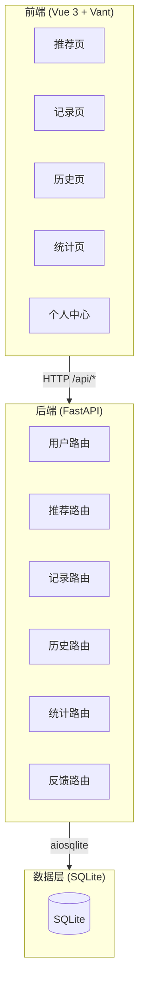
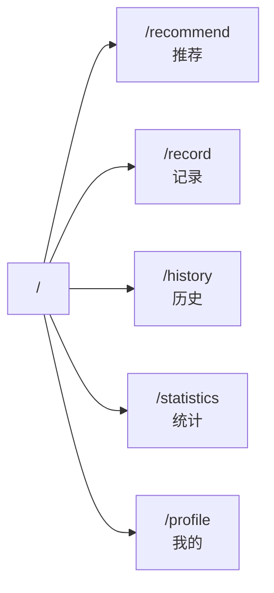
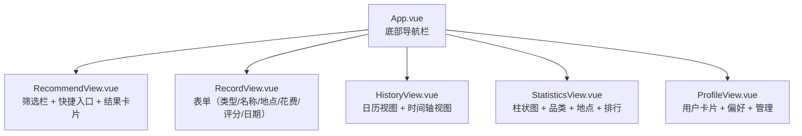
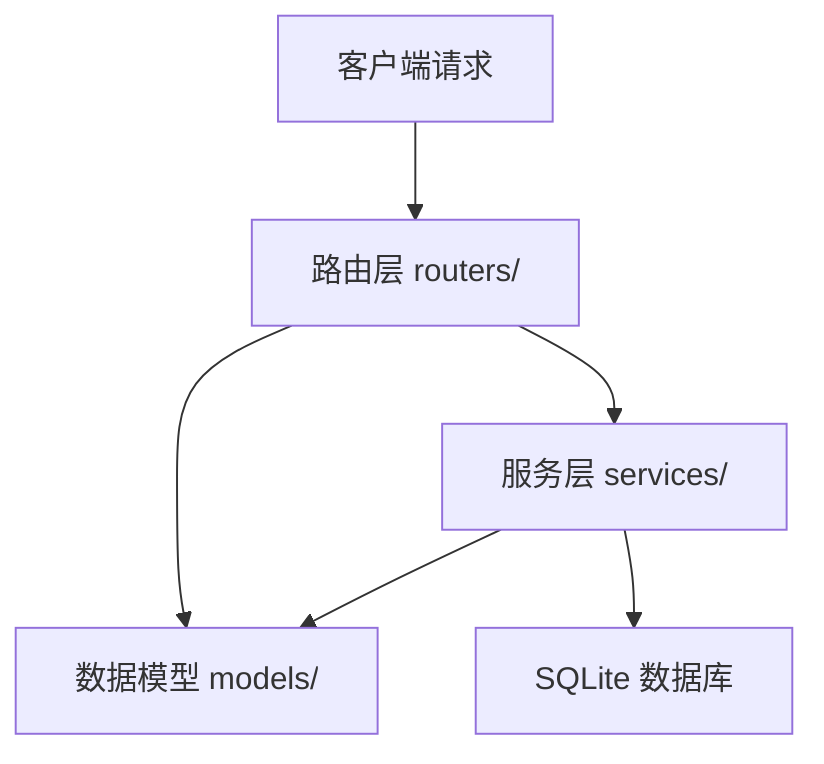
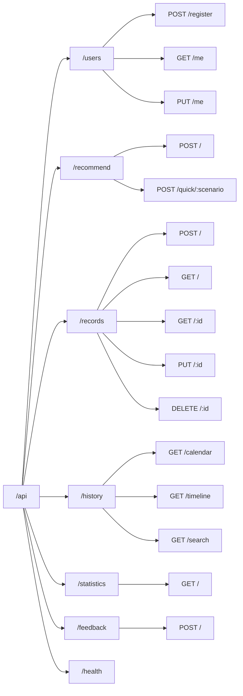
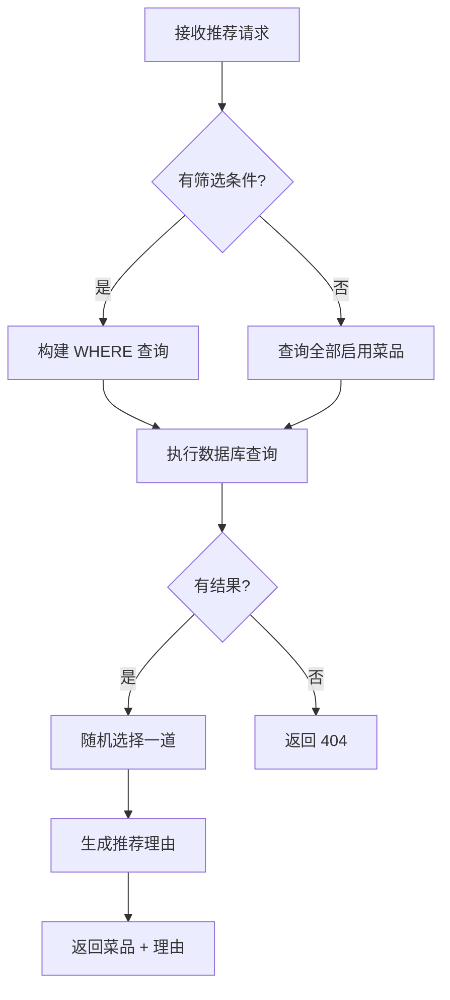
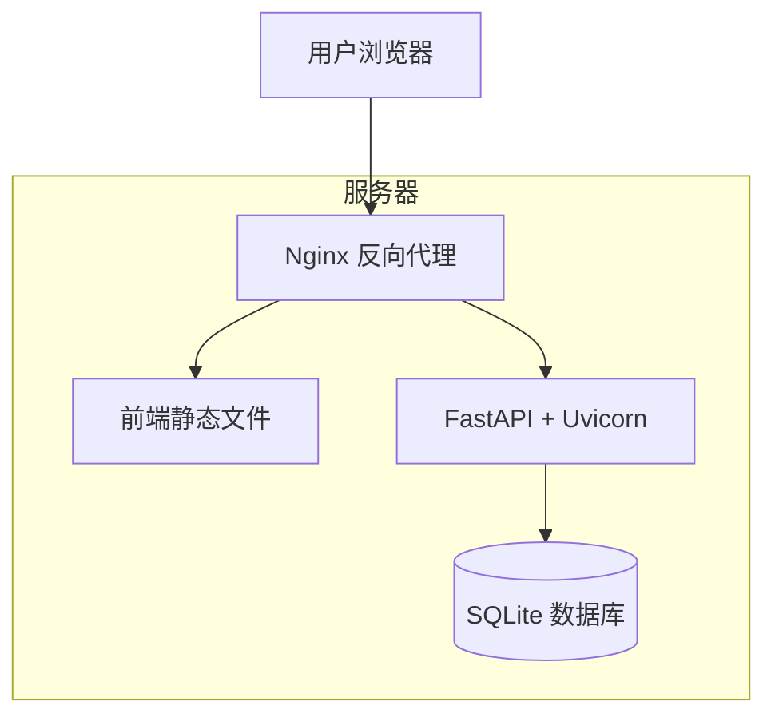

# MealMate（餐伴）- 架构设计文档

## 系统架构



## 前端架构

### 页面路由



### 组件结构



### 状态管理

使用 Pinia 管理全局状态：

| Store | 状态 | 用途 |
|-------|------|------|
| user | user, isLoggedIn | 用户信息和登录状态 |

## 后端架构

### 分层结构



| 层级 | 职责 | 文件 |
|------|------|------|
| 路由层 | 接收 HTTP 请求，参数校验，调用服务 | routers/*.py |
| 服务层 | 业务逻辑（预留扩展） | services/ |
| 数据模型 | Pydantic 类型定义，请求/响应格式 | models/schemas.py |
| 依赖注入 | 数据库连接管理 | core/deps.py |

### API 路由一览



## 数据库设计

详见 [ER-DIAGRAM.md](./ER-DIAGRAM.md)

### 核心表

| 表 | 行数（预估） | 增长率 |
|----|-------------|--------|
| users | O(千) | 低 |
| dishes | O(百) | 低（管理维护） |
| meal_records | O(万/用户) | 高（每餐1-3条） |
| user_feedback | O(千/用户) | 中 |

## 推荐算法



### 筛选逻辑

| 维度 | 查询方式 |
|------|----------|
| 菜系 | `WHERE cuisine = ?` |
| 口味 | `WHERE tags LIKE '%辣%'` |
| 价格 | `WHERE reference_price >= ? AND reference_price < ?` |
| 热量 | `WHERE calories >= ? AND calories < ?` |
| 场景-超饿 | `WHERE prep_time <= 25` |
| 场景-清理冰箱 | `WHERE prep_time <= 20` |

### 未来优化方向

1. **基于用户偏好**：结合 `users.taste_tags` 加权推荐
2. **基于历史反馈**：低评分菜品降低推荐权重
3. **避免重复**：排除近 7 天已吃过的同类菜品
4. **协同过滤**：相似用户喜欢的菜品推荐

## 技术选型详解

### 为什么选 FastAPI

- 原生 async/await 支持，与 aiosqlite 完美匹配
- 自动生成 OpenAPI/Swagger 文档
- Pydantic 集成，请求自动校验
- 性能优于 Flask，开发效率优于 Django

### 为什么选 SQLite

- 零配置，无需安装数据库服务
- 单文件存储，部署简单
- 足够支撑个人/小团队使用
- 后期可无缝迁移到 PostgreSQL

### 为什么选 Vue 3 + Vant

- Vue 3 Composition API 灵活高效
- Vant 专为移动端设计，组件丰富
- Vite 构建速度极快
- 生态成熟，社区活跃

## 部署架构



### 部署步骤

```bash
# 1. 构建前端
cd frontend && npm run build

# 2. 配置 Nginx
# 将 frontend/dist 指向静态文件
# 将 /api 代理到 uvicorn

# 3. 启动后端
cd backend
uvicorn app.main:app --host 0.0.0.0 --port 8000
```
