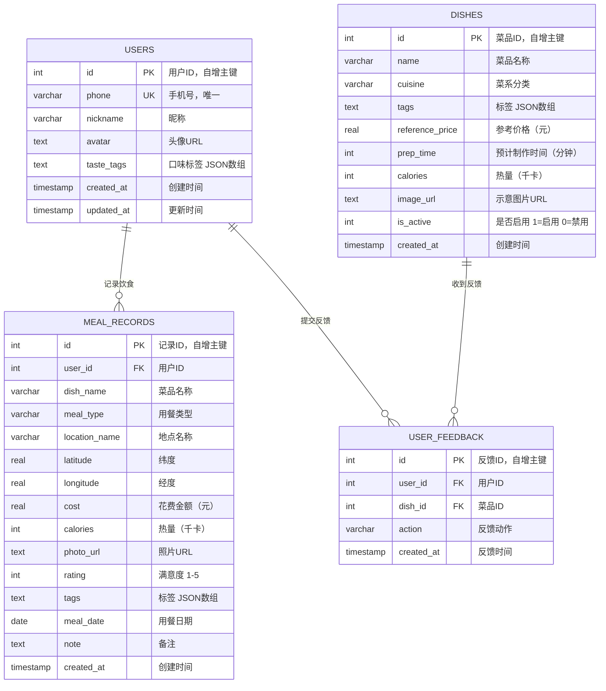

# MealMate（餐伴）- 数据库 ER 图

## 实体关系图



## 表关系说明

| 关系 | 类型 | 说明 |
|------|------|------|
| USERS → MEAL_RECORDS | 一对多 | 一个用户可以有多条饮食记录 |
| USERS → USER_FEEDBACK | 一对多 | 一个用户可以对多道菜提交反馈 |
| DISHES → USER_FEEDBACK | 一对多 | 一道菜可以收到多条用户反馈 |

## 字段约束说明

### USERS 表

| 字段 | 类型 | 约束 | 说明 |
|------|------|------|------|
| id | INTEGER | PRIMARY KEY AUTOINCREMENT | 自增主键 |
| phone | VARCHAR(20) | UNIQUE NOT NULL | 手机号，唯一索引 |
| nickname | VARCHAR(50) | NOT NULL | 昵称 |
| avatar | TEXT | NULL | 头像 URL |
| taste_tags | TEXT | NULL | JSON 数组，如 `["辣","低脂"]` |
| created_at | TIMESTAMP | DEFAULT CURRENT_TIMESTAMP | 注册时间 |
| updated_at | TIMESTAMP | DEFAULT CURRENT_TIMESTAMP | 最后更新时间 |

### DISHES 表

| 字段 | 类型 | 约束 | 说明 |
|------|------|------|------|
| id | INTEGER | PRIMARY KEY AUTOINCREMENT | 自增主键 |
| name | VARCHAR(100) | NOT NULL | 菜品名称 |
| cuisine | VARCHAR(20) | NULL | 菜系：川菜/粤菜/湘菜/日料/西餐/东南亚 |
| tags | TEXT | NULL | JSON 数组，如 `["辣","下饭"]` |
| reference_price | REAL | NULL | 参考价格（元） |
| prep_time | INTEGER | NULL | 预计制作/送达时间（分钟） |
| calories | INTEGER | NULL | 热量（千卡） |
| image_url | TEXT | NULL | 示意图片 URL |
| is_active | INTEGER | DEFAULT 1 | 1=启用 0=禁用 |
| created_at | TIMESTAMP | DEFAULT CURRENT_TIMESTAMP | 创建时间 |

### MEAL_RECORDS 表

| 字段 | 类型 | 约束 | 说明 |
|------|------|------|------|
| id | INTEGER | PRIMARY KEY AUTOINCREMENT | 自增主键 |
| user_id | INTEGER | NOT NULL, FK → USERS(id) | 用户外键 |
| dish_name | VARCHAR(100) | NOT NULL | 菜品名称 |
| meal_type | VARCHAR(10) | NOT NULL | 用餐类型：早餐/午餐/晚餐/下午茶/夜宵 |
| location_name | VARCHAR(200) | NULL | 地点名称 |
| latitude | REAL | NULL | GPS 纬度 |
| longitude | REAL | NULL | GPS 经度 |
| cost | REAL | NULL, CHECK(>=0) | 花费金额（元） |
| calories | INTEGER | NULL, CHECK(>=0) | 热量（千卡） |
| photo_url | TEXT | NULL | 照片 URL |
| rating | INTEGER | NOT NULL, CHECK(1-5) | 满意度评分 |
| tags | TEXT | NULL | JSON 数组，如 `["面食","快捷"]` |
| meal_date | DATE | NOT NULL | 用餐日期 |
| note | TEXT | NULL | 自由备注 |
| created_at | TIMESTAMP | DEFAULT CURRENT_TIMESTAMP | 记录创建时间 |

### USER_FEEDBACK 表

| 字段 | 类型 | 约束 | 说明 |
|------|------|------|------|
| id | INTEGER | PRIMARY KEY AUTOINCREMENT | 自增主键 |
| user_id | INTEGER | NOT NULL, FK → USERS(id) | 用户外键 |
| dish_id | INTEGER | NOT NULL, FK → DISHES(id) | 菜品外键 |
| action | VARCHAR(10) | NOT NULL | 反馈动作：like/dislike/accept |
| created_at | TIMESTAMP | DEFAULT CURRENT_TIMESTAMP | 反馈时间 |

## 索引设计

```sql
-- 用户饮食记录查询优化
CREATE INDEX idx_meal_records_user_id ON meal_records(user_id);
CREATE INDEX idx_meal_records_meal_date ON meal_records(meal_date);
CREATE INDEX idx_meal_records_user_date ON meal_records(user_id, meal_date);

-- 用户反馈查询优化
CREATE INDEX idx_user_feedback_user_dish ON user_feedback(user_id, dish_id);

-- 菜品按菜系查询优化
CREATE INDEX idx_dishes_cuisine ON dishes(cuisine);
```

## 索引设计说明

| 索引 | 用途 | 查询场景 |
|------|------|----------|
| `idx_meal_records_user_id` | 按用户查询记录 | 用户查看自己的饮食记录 |
| `idx_meal_records_meal_date` | 按日期查询记录 | 日历视图、统计分析 |
| `idx_meal_records_user_date` | 按用户+日期查询 | 统计某用户某段时间的数据 |
| `idx_user_feedback_user_dish` | 查询用户对某菜的反馈 | 推荐算法排除低分菜 |
| `idx_dishes_cuisine` | 按菜系筛选菜品 | 推荐时按菜系筛选 |
