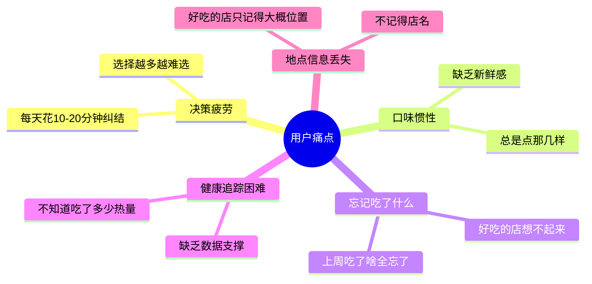
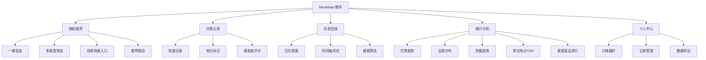
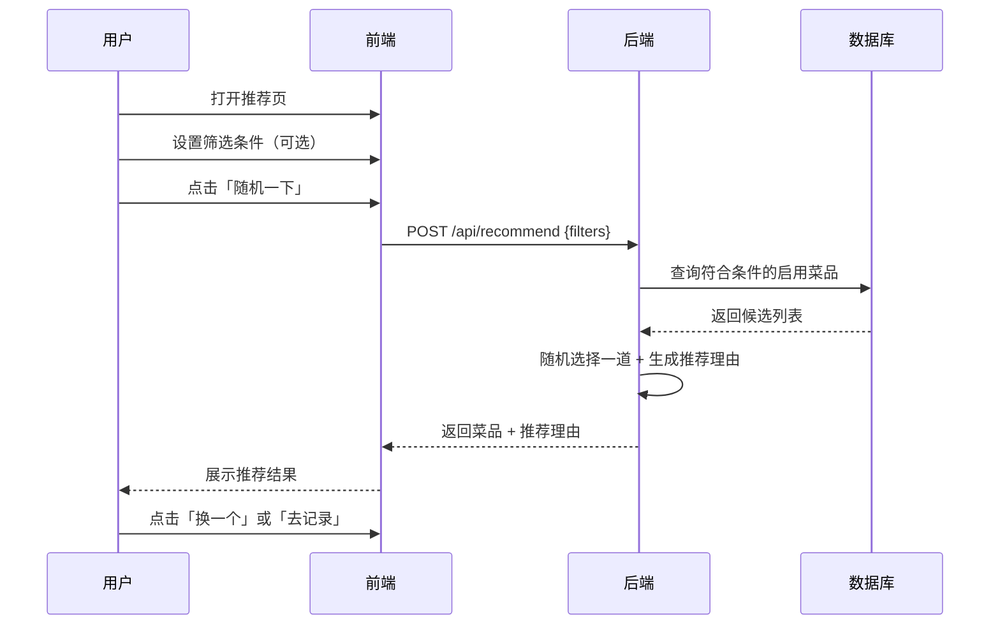
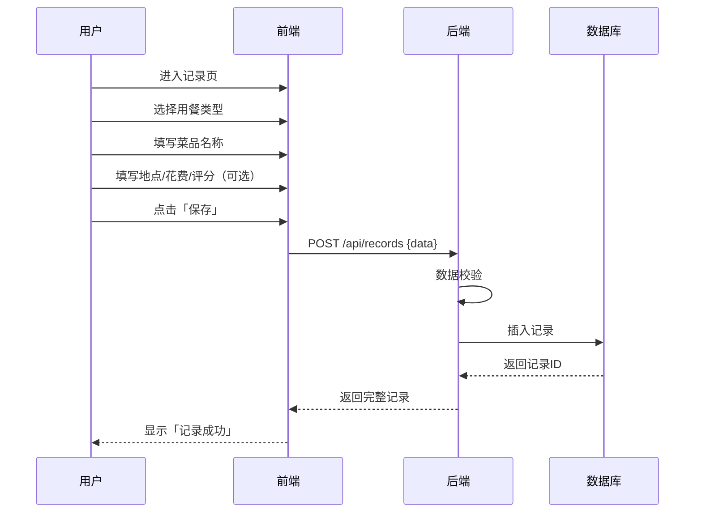
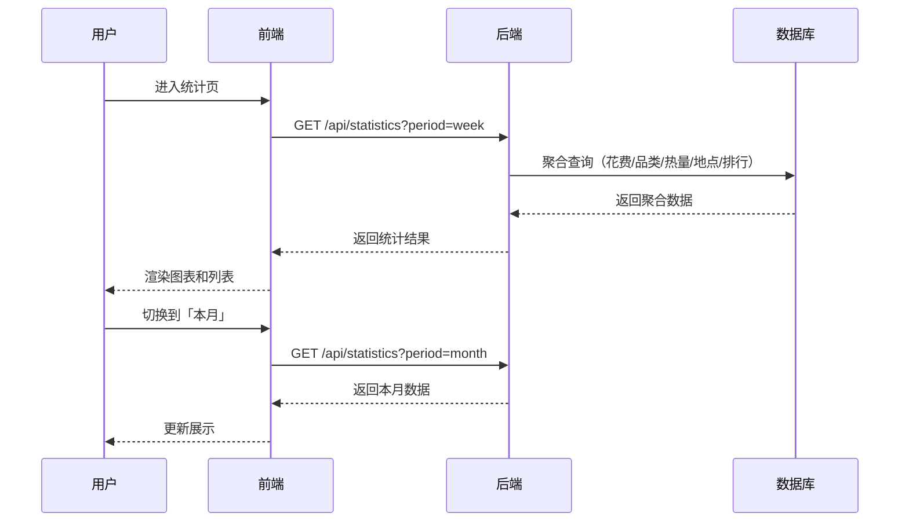

# MealMate（餐伴）- 产品需求文档（PRD）

## 1. 产品概述

### 1.1 产品定位

MealMate（餐伴）是一款解决"今天吃什么"选择困难的智能决策助手，同时提供饮食记录功能，帮助用户形成健康的饮食习惯。

**核心价值主张**：不再纠结吃什么，每顿饭都有一个懂你的伴侣帮你决定、帮你记住。

### 1.2 产品目标

| 目标 | 衡量指标 |
|------|----------|
| 解决选择困难 | 用户平均决策时间 < 30秒 |
| 培养记录习惯 | 用户连续记录天数 ≥ 7天 |
| 提升饮食品质 | 用户满意度评分 ≥ 4.0 |

## 2. 目标用户

| 用户群 | 特征 | 核心诉求 |
|--------|------|----------|
| 独居上班族 | 20-35岁，一人食/外卖为主 | 快速决策、节省时间 |
| 情侣/小家庭 | 两人意见不合 | 解决分歧、发现新选择 |
| 健康管理人群 | 减肥/控糖/健身 | 追踪热量、控制摄入 |
| 学生党 | 预算有限 | 性价比优先、避免重复 |

## 3. 用户痛点

## 4. 功能需求

### 4.1 功能模块总览

### 4.2 模块一：随机推荐

| 功能点 | 说明 | 优先级 |
|--------|------|--------|
| 一键盲选 | 无参数纯随机，返回一道菜 | P0 |
| 多维度筛选 | 支持按口味/菜系/价格/热量筛选 | P0 |
| 场景快捷入口 | 「我超饿」「随便就行」「清理冰箱」 | P1 |
| 推荐理由 | 解释为什么推荐这道菜 | P2 |

**筛选维度：**

| 维度 | 可选值 |
|------|--------|
| 口味偏好 | 辣 / 不辣 / 酸 / 甜 / 鲜 |
| 菜系 | 川菜 / 粤菜 / 湘菜 / 日料 / 西餐 / 东南亚 |
| 用餐场景 | 早餐 / 午餐 / 晚餐 / 夜宵 / 下午茶 |
| 价格档位 | ¥20以下 / ¥20-50 / ¥50-100 / 无限制 |
| 热量范围 | 低卡(<400) / 中卡(400-700) / 高卡(>700) |

### 4.3 模块二：饮食记录

| 功能点 | 说明 | 优先级 |
|--------|------|--------|
| 快速记录 | 手动填写菜品名称、价格、地点 | P0 |
| 地点标记 | GPS获取/手动搜索/收藏地点 | P1 |
| 满意度评分 | 1-5星评分，影响后续推荐 | P0 |
| 用餐类型 | 早餐/午餐/晚餐/下午茶/夜宵 | P0 |

**记录字段定义：**

| 字段 | 必填 | 类型 | 说明 |
|------|------|------|------|
| 菜品名称 | 是 | string | 吃了什么 |
| 用餐类型 | 是 | enum | 早餐/午餐/晚餐/下午茶/夜宵 |
| 满意度 | 是 | int(1-5) | 评分 |
| 用餐日期 | 是 | date | 哪天吃的 |
| 地点名称 | 否 | string | 在哪里吃的 |
| 花费金额 | 否 | float | 花了多少钱 |
| 热量估算 | 否 | int | 大约多少千卡 |
| 照片 | 否 | url | 食物照片 |
| 备注 | 否 | string | 自由备注 |
| 标签 | 否 | list[string] | 自定义标签 |

### 4.4 模块三：历史回顾

| 功能点 | 说明 | 优先级 |
|--------|------|--------|
| 日历视图 | 按日期查看吃了什么 | P1 |
| 时间轴浏览 | 按时间倒序展示所有记录 | P1 |
| 搜索/筛选 | 按菜品名/地点/日期范围搜索 | P2 |

### 4.5 模块四：统计分析

| 统计项 | 展示形式 | 说明 |
|--------|----------|------|
| 本周花费趋势 | 柱状图 | 每日花费汇总 |
| 品类分布 | 进度条 | 按用餐类型分布 |
| 热量趋势 | 折线图 | 每日热量汇总 |
| 常去地点TOP | 列表 | 按访问次数排序 |
| 最爱菜品排行 | 列表 | 按评分和次数排序 |

### 4.6 模块五：个人中心

| 功能点 | 说明 | 优先级 |
|--------|------|--------|
| 口味偏好设置 | 设置默认筛选偏好 | P1 |
| 历史记录管理 | 编辑/删除历史记录 | P1 |
| 数据导出 | 导出为JSON/CSV | P2 |
| 连续记录勋章 | 连续记录天数激励 | P2 |

## 5. 核心业务流程

### 5.1 随机推荐流程

### 5.2 饮食记录流程

### 5.3 查看统计流程

## 6. 非功能需求

| 类别 | 要求 |
|------|------|
| 设备支持 | 移动端优先，支持手机浏览器 |
| 页面加载 | 首屏加载不超过 1.5 秒 |
| 操作响应 | 点击到反馈不超过 200 毫秒 |
| 数据存储 | 用户饮食记录永久保存 |
| 隐私安全 | 饮食记录仅用户本人可见 |

## 7. 业务规则

1. 未登录用户可以浏览推荐，但记录功能需要登录
2. 推荐算法需考虑用户近 7 天的饮食记录，避免连续推荐同类菜品
3. 用户给低评分（1-2 星）的菜品，30 天内不再推荐
4. 连续 3 天未记录时，可发送提醒（可选功能）
